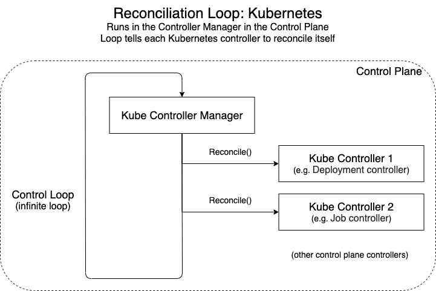
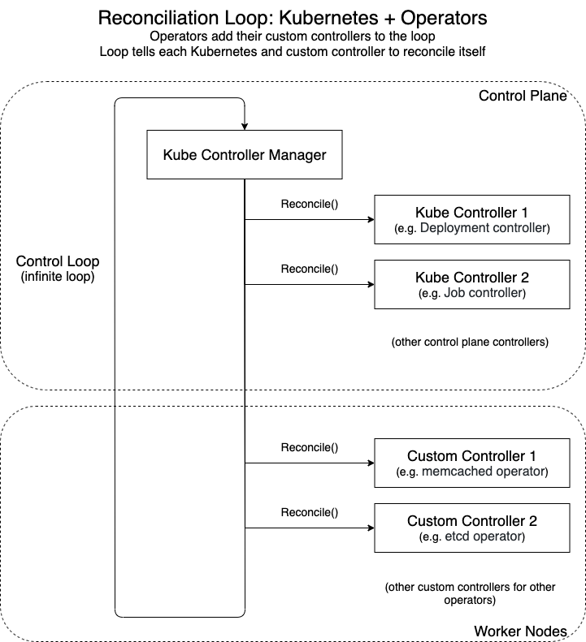

# Anatomy of an operator, demystified

## Introduction

Proponents of operators often describe them as having these two key advantages:
- Operators work the way Kubernetes does
- An operator extends Kubernetes

In this way, operators are the browser plugins of the Kubernetes world, adding custom functionality to Kubernetes' general functionality.

This article explains how operators work, using aspects of how a Kubernetes cluster works to illustrate that operators work similarly.

## Outline
1. [Operator Structure](#1-operator-Structure)
1. [Kubernetes architecture](#2-Kubernetes-architecture)
1. [Workload Deployment](#3-workload-deployment)
1. [Reconcile Loop](#4-Reconcile-Loop)
1. [Reconcile States](#5-Reconcile-States)

## 1. Operator Structure

As far as the Kubernetes cluster is concerned, an operator is just an application. It's a very specialized application, designed to manage another resource running in Kubernetes, such as another application. Kubernetes out-of-the-box is pretty good at managing stateless workloads because all of them are similar enough that they can be managed pretty much the same way. It has difficulty managing stateful workloads because they are more complex and each one is different, requiring custom management. An operator is a specialized application that provides custom management for specialized resources, often stateful workloads. 

A basic operator consists of these components:

These components form the three main parts of an operator:
- API -- The data that describes the resource to be managed and its configuration, comprised of three parts:
  - Custom Resource Definition (CRD) -- The schema of yaml data describing the resource
  - Programmatic API -- The same data schema as the CRD, implemented using the operator's programming language, such as Go
  - Custom Resource (CR) -- An instance of the CRD that describes an instance of the resource using the schema defined in the CRD
- Controller -- The brains of the operator, creates Kubernetes resources based on the description in the CR, implemented using the operator's programming language, such as Go
- RBAC Role and Service Account -- Kubernetes permissions for the controller to create the resource 

A particular operator can be much more complex, but it will still contain this basic structure.

## 2. Kubernetes Architecture

Before we continue, let's quickly review how Kubernetes works. [A Kubernetes cluster consists of these components](https://kubernetes.io/docs/concepts/overview/components/):

These components form the main parts of a cluster:
- Worker nodes -- The computers that run the workloads
- Control plane -- The components that manage the cluster, its nodes and workloads
  - API server -- An API for the control plane, which clients use to manage the cluster
  - Controller manager -- Runs the controller processes; each controller has a specific responsibility as part of managing the cluster

There are other components that implement the cluster, but these are the ones an operator uses.

Because operators are specialized applications, they run in the worker nodes. Yet operators implement controllers, which usually run in the control plane. As we'll see, operators extend the control plane into the worker nodes.

[A cluster's state is managed by controllers reconciling the current state to match the desired state](https://kubernetes.io/docs/concepts/architecture/controller/). A cluster always has two states: desired and current. Desired state represents cluster resources that should exist. Current state represents the resources that actually do exist. Controllers watch for changes in the desired state and then change the current state to make it look like the desired state. The controllers included with Kubernetes run in the control plane.

<b>Note: when you see Spec in the Custom Resource, you can think of it as the desired state. When you see `Status` that refers to the current state.</b> This is very important, since that is how we will update the status of the cluster in our controller code. We will update the Spec when we want to update the desired state, and [update the status subresource](https://github.ibm.com/TT-ISV-org/operator/blob/main/INTERMEDIATE_TUTORIAL.md#update-the-status-to-save-the-current-state-of-the-cluster) when we want to update the current state. 

## 3. Workload Deployment

A very basic workload deployed into a Kubernetes cluster has this structure:

The workload consists of a Deployment that runs a set of Pod replicas, each of which runs a duplicate Container. The Deployment is exposed as a Service, which provides a single fixed endpoint for clients to invoke behavior in the set of replicas.

An operator deploys a workload in very much the same way that a human administrator (or a build pipeline) deploys a workload, but
an operator manages its operand (or workload) using a custom resource. <b>Whenever an operator 
manages a workload, we call that workload (i.e. the resources the operator manages) the `operand`. </b> As illustrated below, the main distinction between
deploying a workload as an admin compared to deploying it as an operator, is the use of custom resources to change the desired state of the cluster and the use of a custom controller to reconcile differences between the current state and desired state. 

An administrator uses client tools such as the `kubectl` CLI and YAML files to tell the cluster what to do, such as to deploy a workload. When an admin runs a command like `kubectl apply -f ./my-manifest.yaml`, what actually happens?
- The client tool talks to the Kube API, the interface for the control plane
- The API performs its commands by changing the cluster's desired state, such as adding a new resource described by `./my-manifest.yaml`
- The controllers in the control plane make changes to the cluster's current state to make it match the desired state

Voilà, a workload is deployed.

When an operator deploys a workload, it does much the same thing:
- The custom resource (CR) acts like an administrator, describing the resource that should be deployed
- The controller uses its API to read the CR and uses the Kube API to create the resource described by the CR, much like an admin running `kubectl` commands

The Kube API doesn't know whether its client is an admin using client tools or an operator running a controller. Either way, it performs the commands the client invokes by updating the desired state, which the controllers use to update the current state. In this way, the operator does what the admin would do, but in an automated way that's encapsulated in its controller's implementation.

## 4. Reconcile Loop

Out of the box, a Kubernetes cluster's control plane implements a reconciliation loop that manages the cluster:

The reconciliation loop is implemented as a control loop in the Controller Manager. The Controller Manager has a list of Controllers that it iterates through, telling each one to Reconcile itself. Each controller is responsible for managing a specific part of the cluster's behavior. All of them do this by adjusting current state to align with desired state. Reconcile is a controller's opportunity to adjust for any changes in the desired state since the last time the controller reconciled.

Each operator extends the reconciliation loop by adding its custom controller to the Controller Manager's list of controllers:

When the Controller Manager runs the reconciliation loop, it not only tells each controller in the control plane to reconcile itself, it also tells each operator's custom controller to reconcile itself. Like a standard controller, Reconcile is the custom controller's opportunity to react to any changes since the last time it reconciled itself.

## 5. Reconcile States

Thus far, we've talked about the relationship between a cluster's desired state and its current state, and how a controller reconciles between those two states for the part of the cluster it manages. The way Kube controllers and operator controllers reconcile is very analogous:

That said, the operator controllers work one level of abstraction higher than the Kube controllers. An operator's desired state is not the cluster's desired state, it is the custom resources (CRs) that drive the operator's controller. This means that when we use operators, the custom resource is what is driving the desired state. The cluster then uses that desired state to adjust its current state. So both kinds of controllers reconcile between desired and current state, <b>but with operators</b> there are three layers of state to adjust between: operators' custom resources reconcile to the cluster's desired state which reconciles to the cluster's current state.

## Conclusion

This article has shown how operators work the way Kubernetes does and extends a cluster to custom manage specialized resources. Operators work like Kubernetes in several aspects:
- The brains of an operator is a controller whose responsibilities are very much like those of a controller in the control plane
- The way an operator deploys a workload is very much like how an administrator deploys a workload; the control plane doesn't know the difference
- The control plane implements a reconciliation loop that gives each controller an opportunity to reconcile itself, and operators add their controllers to that loop
- Both Kube controllers and custom controllers adjust between what they think of as their desired state and their current state, but operators' enable the use of (CRs) to manage desired state.

With this understanding, you'll be better prepared to write your own operators and understand how they work as a part of Kubernetes.
